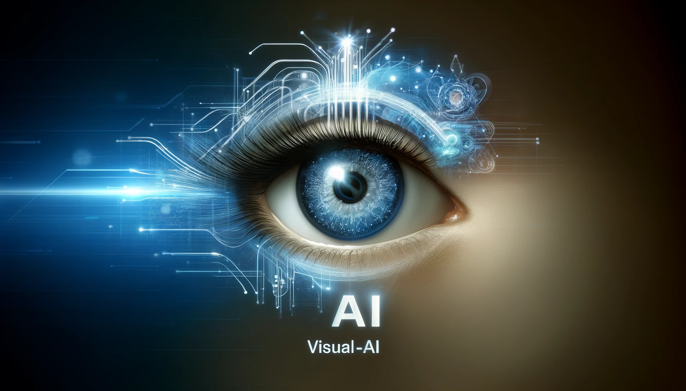
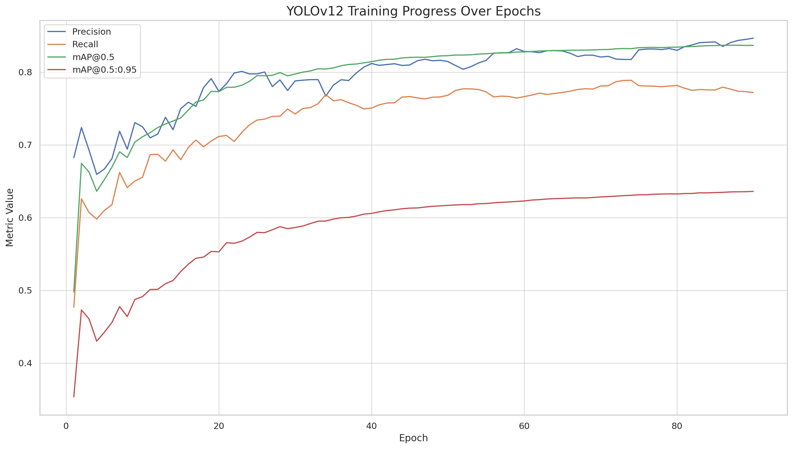

# Visual AI: AI-Powered HealthCare Application



An AI-driven assistive system designed to help visually impaired individuals understand and navigate their environment in real-time.

The solution integrates multiple computer vision technologies:
- **YOLOv12m** for precise and efficient object detection.
- **Apple Depth Pro** for accurate monocular depth estimation.
- **pyttsx3** for offline text-to-speech feedback in real-time.
- **Streamlit** to deliver a lightweight, interactive frontend interface.

The system was built and optimized to run on GPU-based cloud instances (AWS), ensuring smooth performance even during complex visual scenes. The application was initially prototyped for desktop (Streamlit) and is planned for mobile deployment in future stages.

---

## 🧠 Tech Stack

| Component            | Description                                        |
|---------------------|----------------------------------------------------|
| Language             | Python                                             |
| Object Detection     | YOLOv12 (Ultralytics)                               |
| Depth Estimation     | Apple Depth Pro                          |
| Data Processing      | OpenCV, NumPy, Pandas                              |
| Voice Feedback       | pyttsx3                                            |
| Web Interface        | Streamlit                                          |
| Deployment Target    | AWS (with RDS for DB support)                     |

---

## 🚀 Getting Started

### 1. Clone & Setup
```bash
git clone https://github.com/Natanael-hash/Visual-AI.git
cd Visual-AI
python -m venv env
source env/bin/activate  # On Mac/Linux
# or
env\Scripts\activate  # On Windows
pip install -r requirements.txt
```

### 2. Run Streamlit Interface
```bash
streamlit run app.py
```

Visit `http://localhost:8501` to interact with the interface.

---

## 🎥 Object Detection (Prototype)

For testing with 4K video or webcam:

```python
from ultralytics import YOLO
model = YOLO("object_detection_model-3.pt")
# Test with video or image
model.predict("path/to/video/or/image", save=True, imgsz=640, conf=0.5, device="mps", show=True)
# Real-time webcam detection
model.predict(0, save=True, imgsz=640, conf=0.5, device="mps", show=True)
```

---

## 📊 Training Overview

The custom YOLOv12m model was trained on a dataset of over 30,000 annotated images, many of which were obtained by slicing high-resolution video frames, though not all images originated from this process. Annotations were refined using Roboflow's platform and manually corrected to avoid mislabeling.

**Training configuration**:
- Epochs: 100
- Batch size: 16
- Image size: 864
- Optimizer: SGD with lr0=0.001 and cosine LR scheduling
- Patience: 20 (early stopping)
- Cache: Enabled for fast loading
- Device: GPU (A100)



The model achieved strong generalization with a final mAP of 0.837, and was validated on multiple video environments to ensure robustness and real-time performance.

---

## 📈 Future Roadmap

- [ ] Improve detection for edge-cases (e.g., low light).
- [ ] Add multilingual voice support.
- [ ] Expand platform to Android/iOS.
- [ ] Add user sign-up/login with MySQL and RDS integration.

---

## 🤝 Contributing

Feel free to fork and contribute — PRs are welcome!

---

## 📫 Contact

**Author**: Natanael Hordon  
📧 Email: natanaelhordon@icloud.com  
🔗 GitHub: [Natanael-hash](https://github.com/Natanael-hash)  
🔗 LinkedIn: [natanael-hordon-b04bb22b5](https://linkedin.com/in/natanael-hordon-b04bb22b5)
